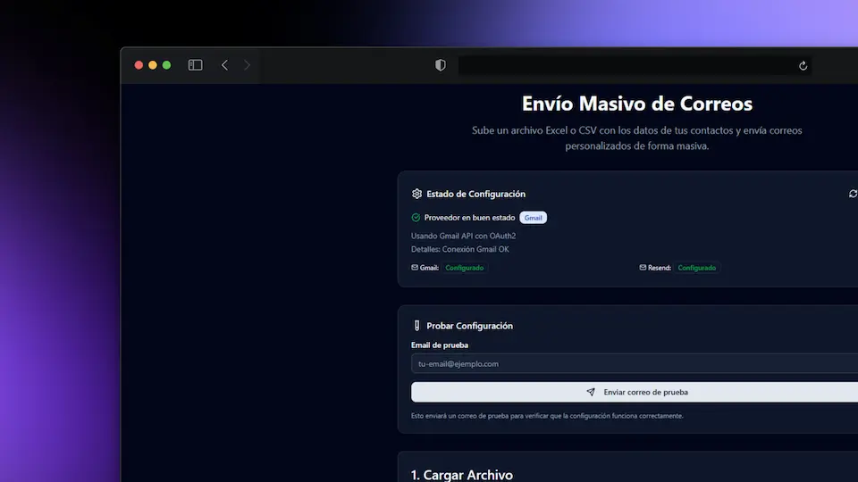

# 📧 Email Sender - Envío Masivo de Correos

<p align="center">
  
</p>

Una aplicación web moderna desarrollada con Next.js 15 que permite el envío masivo de correos electrónicos personalizados a través de múltiples proveedores de email.

## ✨ Características

- 🔐 **Autenticación con Google** usando NextAuth.js
- 📁 **Carga de archivos** Excel (.xlsx) y CSV
- 👀 **Vista previa de datos** antes del envío
- 📧 **Envío masivo** con personalización de mensajes
- 🎨 **Interfaz moderna** con modo claro/oscuro
- 🔄 **Múltiples proveedores** de email (Gmail, Resend)
- 📊 **Reportes de envío** con estadísticas de éxito/fallos
- 🧪 **Email de prueba** para validar configuración

## 🛠️ Tecnologías Utilizadas

- **Frontend:** Next.js 15, React 19, TypeScript
- **Estilos:** Tailwind CSS, Radix UI
- **Autenticación:** NextAuth.js con Google OAuth
- **Base de datos:** SQLite con Prisma ORM
- **Email:** Gmail API, Resend
- **Procesamiento:** Papa Parse (CSV), XLSX (Excel)

## 🚀 Instalación y Configuración

### Prerrequisitos

- Node.js 18 o superior
- pnpm (recomendado) o npm
- Cuenta de Google para OAuth
- Aplicación en Google Console con OAuth (Gmail API)
- API Key de Resend (opcional)

### 1. Clonar el repositorio

```bash
git clone https://github.com/WillJkdev/email-sender.git
cd email-sender
```

### 2. Instalar dependencias

```bash
pnpm install
# o
npm install
```

### 3. Configurar variables de entorno

Crea un archivo `.env.local` en la raíz del proyecto con las siguientes variables:

```env
# Resend (Opcional)
RESEND_API_KEY="tu_resend_api_key"
RESEND_FROM_EMAIL="tu_email@dominio.com"

# Google OAuth (Requerido)
AUTH_GOOGLE_ID="tu_google_client_id"
AUTH_GOOGLE_SECRET="tu_google_client_secret"

# NextAuth (Requerido)
AUTH_SECRET="tu_auth_secret_muy_seguro"
NEXTAUTH_URL="http://localhost:3000"
AUTH_TRUST_HOST=true

# Base de datos
DATABASE_URL="file:./dev.db"
```

### 4. Configurar Google OAuth

1. Ve a [Google Cloud Console](https://console.cloud.google.com/)
2. Crea un nuevo proyecto o selecciona uno existente
3. Habilita la API de Gmail (si planeas usar Gmail como proveedor)
4. Crea credenciales OAuth 2.0:
   - Tipo: Aplicación web
   - URIs de redirección autorizadas: `http://localhost:3000/api/auth/callback/google`
5. Copia el Client ID y Client Secret a tu archivo `.env.local`

### 5. Configurar la base de datos

```bash
# Generar el cliente de Prisma
pnpm prisma generate

# Ejecutar migraciones
pnpm prisma migrate dev
```

### 6. Ejecutar la aplicación

```bash
# Modo desarrollo
pnpm dev

# Modo producción
pnpm build
pnpm start
```

La aplicación estará disponible en `http://localhost:3000`

## 📋 Uso

### 1. Autenticación

- Accede a la aplicación y haz clic en "Iniciar sesión con Google"
- Autoriza los permisos necesarios

### 2. Verificar configuración

- La aplicación verificará automáticamente tu configuración de email
- Asegúrate de que al menos un proveedor esté configurado correctamente

### 3. Probar email

- Usa la función "Email de prueba" para verificar que todo funciona
- Envía un email de prueba a tu dirección

### 4. Cargar datos

- Sube un archivo Excel (.xlsx) o CSV con los datos de contacto
- El archivo debe contener al menos una columna "email"
- Columnas opcionales: name, firstName, lastName, etc.

### 5. Envío masivo

- Revisa la vista previa de tus datos
- Configura el asunto y mensaje personalizado
- Haz clic en "Enviar correos" y espera los resultados

## 📁 Estructura del Proyecto

```
email-sender/
├── src/
│   ├── app/                 # App Router de Next.js
│   │   ├── api/            # API Routes
│   │   ├── login/          # Página de login
│   │   └── page.tsx        # Página principal
│   ├── components/         # Componentes React
│   │   ├── auth/           # Componentes de autenticación
│   │   ├── email/          # Componentes de email
│   │   ├── layout/         # Componentes de layout
│   │   └── ui/             # Componentes UI base
│   ├── lib/                # Utilidades y configuración
│   │   ├── auth/           # Configuración de NextAuth
│   │   ├── database/       # Cliente de Prisma
│   │   └── email/          # Templates de email
│   └── services/           # Servicios de negocio
│       └── email/          # Servicio de email
├── prisma/                 # Esquema y migraciones
├── public/                 # Archivos estáticos
└── package.json
```

## 🔧 Configuración Avanzada

### Proveedores de Email

La aplicación soporta múltiples proveedores:

#### Gmail

- Requiere OAuth con Google
- Usa la API de Gmail
- Sin límites de envío (según tu cuenta)

#### Resend

- Requiere API Key de Resend
- Fácil configuración
- 100 emails gratis por día

### Personalización de Templates

Los templates de email se pueden personalizar en `src/lib/email/templates.ts`:

```typescript
export const getEmailTemplate = (data: EmailData, customMessage?: string) => {
  return `
    <h1>Hola ${data.name || "Usuario"}</h1>
    <p>${customMessage || "Mensaje por defecto"}</p>
  `;
};
```

## 🤝 Contribuciones

Las contribuciones son bienvenidas. Por favor:

1. Fork el proyecto
2. Crea una rama para tu feature (`git checkout -b feature/AmazingFeature`)
3. Commit tus cambios (`git commit -m 'Add some AmazingFeature'`)
4. Push a la rama (`git push origin feature/AmazingFeature`)
5. Abre un Pull Request

## 📄 Licencia

Este proyecto está bajo la Licencia MIT. Ver el archivo `LICENSE` para más detalles.

## 🐛 Reportar Problemas

Si encuentras algún problema o tienes sugerencias, por favor abre un [issue](https://github.com/WillJkdev/email-sender/issues).

## 📞 Soporte

Para soporte adicional, puedes:

- Abrir un issue en GitHub
- Contactar al desarrollador

---

⭐ Si este proyecto te fue útil, ¡no olvides darle una estrella!
